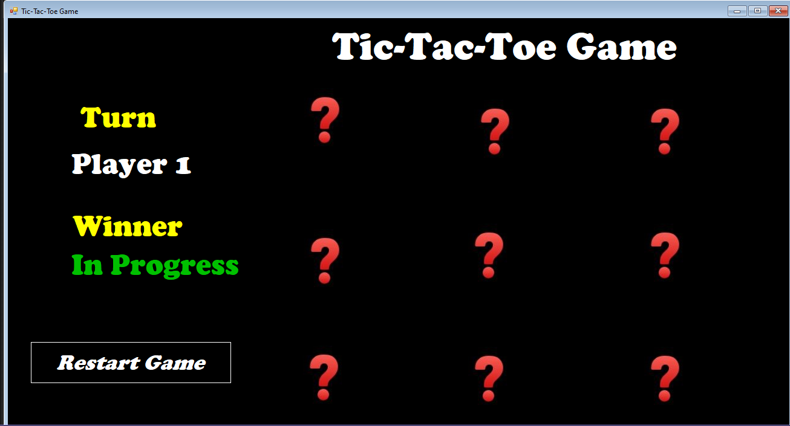

# 🎮 XO Game

A simple Tic-Tac-Toe (XO) game built using C# and Windows Forms.

## 📸 Screenshot

## ✨ Features

- Two-player mode
- Winner detection
- Draw detection
- Reset game
- Score tracking
- Simple and clean UI

## 🛠️ Technologies

- C#
- Windows Forms (.NET Framework)
- Visual Studio

## ▶️ How to Run

1. Clone the repository.
2. Open the solution in Visual Studio.
3. Press F5 to run.

## 👨‍💻 Author

Saied Nasef
